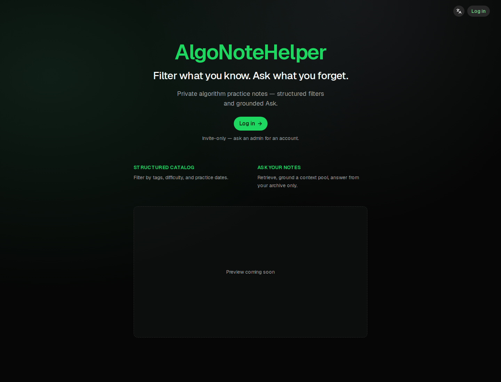
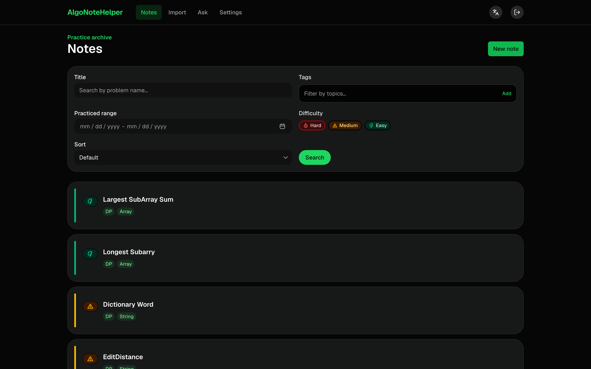
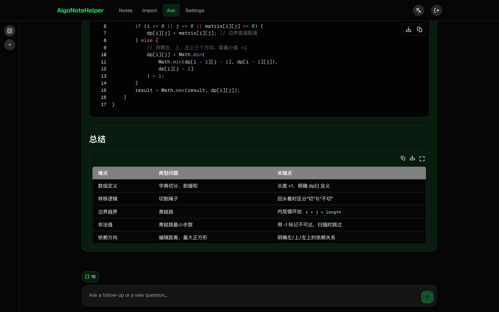
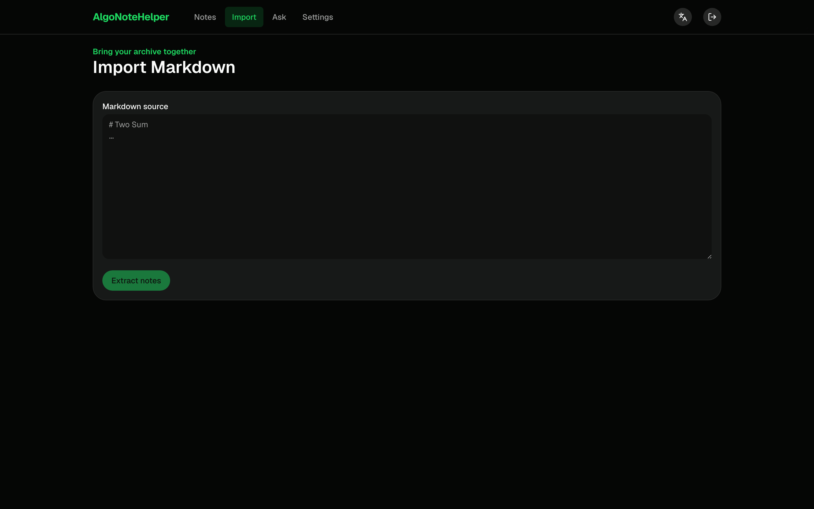
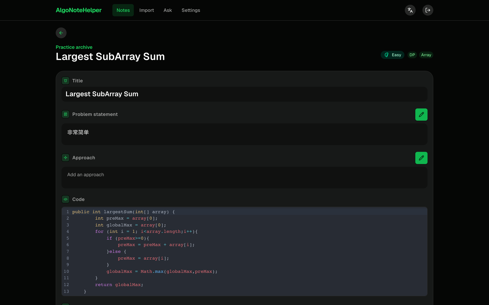

# AlgoNoteHelper

Private algorithm practice note catalog — **filter** what you know, **ask** what you forget.

[](https://algonote.keyneswu.com)
[](https://nextjs.org/)
[](https://fastapi.tiangolo.com/)
[](https://github.com/pgvector/pgvector)
[](https://heroui.com/)

Import or write structured practice notes once, then reopen them in two paths:

| Path | What it does |
|---|---|
| **1 · Filter** | Browse the catalog with tags, difficulty, title, and practice dates |
| **2 · Ask** | Retrieve with embeddings → build a grounding pool → answer from *your* notes only |

<p align="center">
  
</p>

---

## Tech stack

| Layer | Stack |
|---|---|
| **Frontend** | Next.js 16 (App Router) · React 19 · HeroUI v3 · Tailwind CSS 4 · next-intl · assistant-ui · CodeMirror |
| **Auth** | Better Auth (email/password + admin) · Next.js BFF → FastAPI identity bridge |
| **API** | FastAPI · SQLAlchemy 2 · Alembic · Pydantic Settings |
| **Data** | PostgreSQL 17 + pgvector |
| **AI** | BYOK chat + embedding (e.g. DeepSeek / DashScope) — keys in Settings |
| **Tooling** | Docker Compose · uv · pnpm |

```text
Browser ──► Next.js (Better Auth + /api/bff/*)
                 │  X-User-Id + X-Internal-Secret
                 ▼
              FastAPI ──► Postgres 17 + pgvector
```

---

## Core features

### 1. Structured notes catalog (Path 1)

Filter by title, preset tags (AND), difficulty, and practiced date range. Sort by learning order, difficulty, or last practiced. Filter state stays in the URL.



### 2. Ask grounded in your notes (Path 2)

Natural-language Q&A over your archive: embedding retrieval → Notebook context bar → streaming answer. Multi-turn sessions with a collapsible session rail.



### 3. Markdown import & soft dedup

Paste Markdown → AI extracts candidates → preview / edit / commit. Soft similarity surfaces likely duplicates; merge fields or keep as new.



### 4. Note detail

Markdown statement & approach, CodeMirror for code, practice-history chips, optional AI rewrite helpers.



### 5. Auth, admin & BYOK

No public signup. First admin via `/setup`; admins manage users in Settings. Each user configures and verifies their own chat + embedding API keys.

---

## Quick start

```bash
cp .env.example .env
docker compose up --build
```

| Service | URL |
|---|---|
| App | http://localhost:3000 |
| API health | http://localhost:8000/health |

### First run

1. Open the app — you go to `/setup` when no users exist.  
2. Create the first **admin** (email + password).  
3. Sign in at `/login`.  
4. In **Settings**, configure and **verify** Chat + Embedding keys (BYOK).  
5. Import Markdown, filter notes, or Ask.

Admins create accounts under **Settings → Users** (public registration stays off).

> **Production tip:** Named volume `pgdata` persists across `up --build`. Never run `docker compose down -v` on production unless you intend to wipe the database.

---

## Local development

<details>
<summary><strong>Database</strong></summary>

```bash
docker compose up db -d
```

Uses `pgvector/pgvector:pg17-trixie` and enables the `vector` extension on init.

</details>

<details>
<summary><strong>API</strong></summary>

```bash
uv sync
uv run uvicorn app.main:app --reload --port 8000
# optional
uv run alembic upgrade head
```

</details>

<details>
<summary><strong>Frontend</strong></summary>

```bash
cd frontend
pnpm install
pnpm dlx auth@latest migrate    # Better Auth tables
pnpm dev
```

Root `.env` is shared (`frontend/.env` → `../.env` symlink).

</details>

---

## Architecture notes

**Identity bridge.** Sessions live in Better Auth on Next.js. `/api/bff/*` validates the session and calls FastAPI with `X-User-Id` + `X-Internal-Secret`. Notes are always scoped by that user id — admin does **not** bypass ownership.

**Environment.** Copy `.env.example` → `.env` (never commit `.env`):

| Variable | Role |
|---|---|
| `DATABASE_URL` | Sync Postgres (Better Auth) |
| `DATABASE_URL_ASYNC` | Async Postgres (FastAPI) |
| `INTERNAL_API_SECRET` / `BETTER_AUTH_SECRET` / `SECRETS_ENCRYPTION_KEY` | Change before shared deploy |
| `DEEPSEEK_*` / `DASHSCOPE_*` | Optional defaults; runtime BYOK is in Settings |
| `IMAGE_TAG` | Optional; production SHA for GHCR pulls |

---

## Deploy

Prefer **manual SSH** until CI SSH auth is fully reliable:

```bash
ssh ubuntu@<SERVER_IP>
cd ~/dev/projects/AlgoNoteHelper
git pull
docker compose up --build -d
```

Server `.env` must use the HTTPS domain for `BETTER_AUTH_URL`, `NEXT_PUBLIC_APP_URL`, and `CORS_ORIGINS`.

**Schema changes are manual** — CD does not run Alembic / Better Auth migrate. Backup → deploy → `docker compose exec api alembic upgrade head` → verify login & notes.

Optional workflows: `.github/workflows/` (CI, GHCR images, SSH deploy). Treat CD as optional.

---

## Screenshots

Place UI captures in [`docs/screenshots/`](docs/screenshots/):

| File | Page |
|---|---|
| `00-landing.png` | Marketing landing (`/`) |
| `00-login.png` | Login |
| `01-notes.png` | Notes catalog (Path 1) |
| `02-ask.png` | Ask + context bar (Path 2) |
| `03-import.png` | Markdown import |
| `04-note-detail.png` | Note detail |
